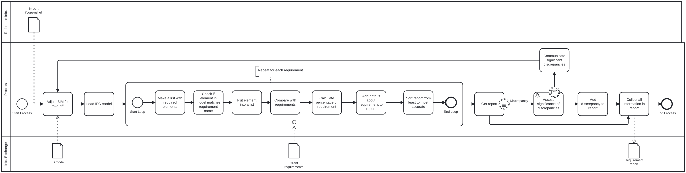

# A4: Teach 

## Summary

Title: GFA estimate, area distribution and rough price estimate

Category: BUILD

Description: Calculates GFA from NetFloorAreas and Wall/Column footprint, returns GFA and distribution of areas across area types, calculates rough estimate based on price per $m^2$ input.

## Quick introduction

We are group 48 in BUILD, and the tool we have developed is a relatively simple tool, made to quickly list all areas in an architectural model.

With the input of an IFC model with IfcSpace, IfcWall, IfcCurtainWall and IfcColumn defined, our tool outputs an overview of all areas, as well as the areas occupied by walls, curtainwalls and columns in the shape of a .json file.

This session is not a dedicated tutorial on how to use the tool (please refer to the A3 submission for that), but rather looks at the following:
- a view into the thoughts behind the tool 
- how it works 
- the challenges faced

### Finding the concept

In the early stages of development, the initial idea was to compare a given IFC model against a list of client requirements, where given a list of requirements and a model, the tool would indicate compliance. This was specifically targeted at the building requirements given in the Advanced Building Design course.



However, after coordination with the rest of the team, it was evident that this was too complex and that more value could be produced from simply listing the distribution of areas in a model for the following reasons:
- The tool would become much easier to use by not having to understand a set logic for comparison, while almost providing the same level of information.
- A simple overview of the different areas are useful to a larger part of the group (e.g. useful to MEP for planning heating, cooling, ventilation etc.)
- The code behind the tool also becomes both simpler and easier to understand.

## Tutorial

### Prerequisites
For the tool to function correctly, the IFC model must include the following information:

- **Spaces**
  - Must be of type *IfcSpace*.
  - Must contain *NetFloorArea* in the quantity set *Qto_SpaceBaseQuantities*.

- **Walls**
  - Must be of type *IfcWall* or *IfcCurtainWall*.
  - The *Name* or *ObjectType* must include either *interior* or *exterior*.
  - Must contain *Length*, *NetSideArea*, and *NetVolume* in the quantity set *Qto_WallBaseQuantities*.

- **Columns**
  - Must be of type *IfcColumn*
  - Must contain *Depth* and *Width* in the property set *Dimensions*.

### How to Use the Tool
1. Load your IFC model.  
2. Import the tool from the project folder.  
3. Run the tool.  
4. Open the generated JSON file to view the results.

### The Tool

**Importing the tool**

```python
from A3_Tool import area_output_to_json
```

**Using the tool**

```python
output = area_output_to_json(model, file_path, output_filename)
```

Only the IFC model is required as input.

**Reading the output**

- The tool generates a JSON file containing the results in a dictionary format.  
- Open the JSON file to inspect the results.  

## The Tool
The tool consists of 7 separate functions;
- One for calculating the total area and number of all spaces.
- One for calculating the total area of all space types.
- Four for calculating floor area used on walls and columns.
- One final that gathers the areas and outputs them as a .json file.

### Imports
```python
import ifcopenshell
import ifcopenshell.util.element
import json
import os
import csv
import shutil
```

### Functions

#### Area of spaces:
The first two functions calculates total area of the entire model, and for any defined type of space in a given IFC model

While the first function simply sums up NetFloorArea of all spaces, the second first sorts

```python
def total_area_and_number(model):
    # Extract all spaces from the IFC model
    spaces = model.by_type("IfcSpace") 
    Area_sum = []

    # Iterates through every space found in the model
    for space in spaces:
        # Retrieve only quantity sets for the current space
        qtos = ifcopenshell.util.element.get_psets(space, qtos_only=True)
        if 'Qto_SpaceBaseQuantities' in qtos:
            sqrm = qtos['Qto_SpaceBaseQuantities']['NetFloorArea']
            Area_sum.append(sqrm)
        else:
            print('Qto_SpaceBaseQuantities is missing for space:', space)

    # Returns two values:
    # 1) The total area
    # 2) The total number of spaces in the model
    return round(sum(Area_sum), 1), len(Area_sum)

def get_area_by_space_types(model):
    # Extract all spaces from the IFC model
    spaces = model.by_type("IfcSpace")
    space_list = []
    area_by_type = {}

    # Create a list of all spaces
    for space in spaces:
        space_list.append(space.LongName)
    # Change the list to only contain each space type once
    space_types = list(dict.fromkeys(space_list))

    # Iterate through each type of space
    for type in space_types:
        # Create list to sum total area for each space type
        area_by_type[type] = []
        for space in spaces:
            if space.LongName == type:
                qtos = ifcopenshell.util.element.get_psets(space, qtos_only=True)
                if 'Qto_SpaceBaseQuantities' in qtos:
                    sqrm = qtos['Qto_SpaceBaseQuantities']['NetFloorArea']
                    # Add space type with corresponding area to the dictionary initiated in the top
                    area_by_type[type].append(sqrm)
                else:
                    print('Qto_SpaceBaseQuantities is missing for space:', space)
        # sum the list for the current space type
        area_by_type[type] = round(sum(area_by_type[type]),2)

    # Returns one value:
    # 1) A dictionary with each type of space and the corresponding summed area
    return area_by_type
```

#### Area of 'Walls/Columns'

For Exterior walls, Interior walls, Courtain walls and columns, the code is almost identical. As such, only one of them is shown here:

```python
def interior_walls_area(model):
    # Extract all walls from the IFC model
    walls = model.by_type("IfcWall")
    area_sum = 0.0

    # Iterate through each wall
    for wall in walls:
        wall_type = wall.ObjectType
        wall_name = wall.Name
        # Goes through the walls and picks out all interior walls
        if wall_type and "Interior".lower() in wall_type.lower() or wall_name and "Interior".lower() in wall_name.lower():
            qtos = ifcopenshell.util.element.get_psets(wall, qtos_only=True)
            # for all spaces with the defined quantity set, get length area and volume
            if 'Qto_WallBaseQuantities' in qtos:
                length = qtos['Qto_WallBaseQuantities'].get('Length',0)
                sidearea = qtos['Qto_WallBaseQuantities'].get('NetSideArea',0)
                volume = qtos['Qto_WallBaseQuantities'].get('NetVolume',0)
                # Calculate floor area under the wall and sum it together
                if sidearea > 0.0:
                    width = volume / sidearea
                    area = width * length * 10**-3
                    area_sum += area
            else:
                print('Qto_WallBaseQuantities is missing for wall:', wall_name, wall_type)
    
    # Returns one value:
    # 1) The summed floorarea covered by interior walls
    return round(area_sum, 2)
```

#### Collect into list of areas:

Creates a dictionary with area types and areas in sqm, and outputs total along with an estimated price.

```python
def area_output_to_json(model, file_path, output_filename):
    # Define all informations from other functions
    spaces_area = get_area_by_space_types(model)
    total_area_number_of_spaces = total_area_and_number(model)
    walls_area_int = interior_walls_area(model)
    walls_area_ext = exterior_walls_area(model)
    curtainwalls_area = curtain_walls_area(model)
    columns_total_area = columns_area(model)
    gross_floor_area = round(total_area_number_of_spaces[0] + walls_area_int + walls_area_ext + curtainwalls_area + columns_total_area, 2) 

    # File handling: Copy and read CSV files
    csv_files, folder_path = copy_csv_files_to_folder(file_path)

    # Create a dictionary with the information
    output_data = {
        "Area of spaces": spaces_area,
        "Total area of spaces": total_area_number_of_spaces[0],
        "Total number of spaces": total_area_number_of_spaces[1],
        "Area of interior walls": walls_area_int,
        "Area of exterior walls": walls_area_ext,
        "Area of curtain walls": curtainwalls_area,
        "Area of columns": columns_total_area,
        "Total summed area": gross_floor_area
    }

    output_path = os.path.join(folder_path, output_filename)
    with open(output_path, "w", encoding='utf-8') as json_file:
        json.dump(output_data, json_file, indent=4)
    print(f"JSON file saved to {output_path}")

    # Creates one file:
    # 1) .json file with area data
```

## Challenges
While working with building the script we met a variety of technical and practical hurdles that needed to be addressed to create a flexible and maintainable solution. 

In the scripting process we encountered two main challenges:

#### Relying solely on quantity sets
For the sake of simplicity and for less reliance of Revit, we aimed to create functions only depending on quantity sets. Ensuring this proved to be difficult, as not every element in an IFC file necessarily have these sets defined or populated correctly. Inconsistencies or gaps in how quantity sets are assigned across different models and authoring tools require manual preprocessing or additional logic to attain reliable results.

#### Folder handling and CSV file management
Locating and copying the correct CSV file from directory structures present compatability concerns, especially when scripts are moved between different computers or environments. Functions hardcoded to specific folder paths or file names lose portability, so scripts must include dynamic directory handling and robust error checking to remain usable for various users and projects.

## Possible improvements
#### CSV-files
Currently, the code requires a CSV file with a specific column header to calculate the aggregated price per $m^2$. To improve flexibility, the function could be modified to handle CSV files with different structures or column names, ensuring that the script does not depend on a single predefined format.

#### Missing data
We aimed to design a script that relies on as few variables as possible. To achieve this, most functions were built to depend only on quantity sets, with the exception of columns, which did not include any. A potential improvement would be to begin the script by processing the IFC file to ensure that all relevant elements contain the necessary quantity sets before the main calculations run.

#### Failsafes
To make the script more robust and compatible with different IFC files, additional failsafes should be implemented. These checks ensure that the script can handle missing elements, undefined values, or unexpected data structures without causing errors or interruptions during execution.
